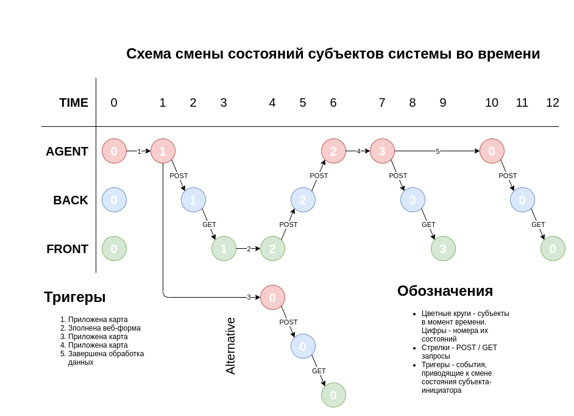
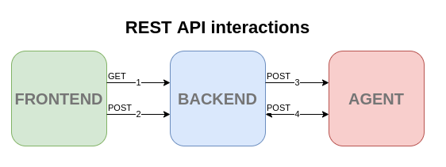

# Robonomics QA architecture

## Содержание

[TOC]

## Субъекты системы
Система представляет собой набор из двух микросервисов (Agent, Backend), разворачиваемых  в Docker контейнерах и общающихся друг с другом посредством Rest API.

### Агент
Демон, отвечающий за работу со всем оборудованием (камера, RFID-reader) и взаимодействие с IPFS, Pinata, Robonomics. Авторизует работника, формирует паспорта изделий. Имеет Rest API интерфейс, на который присылает запросы бекенд. Отсылает запросы на API интерфейс бекенда.

### Frontend
Веб страница, которая отображается на экране у работника. Загружается с бекенда в браузере локально. Позволяет выбирать модель изделия и дополнительные опции. Отображает статус системы. Получает состояние системы с бекенда с помощью long polling и отправляет на него данные с помощью POST запросов.

### Backend
Имеет Rest API интерфейс, на который присылает запросы фронтенд, обеспечивает взаимодействие агента и фронтенда. Проксирует запросы от фронтенда на агент. Хранит состояние агента и транслирует его фронтенду, пока агент не пришлет запрос на изменение своего состояния через Rest API.

## Состояния систем
Система работает по принципу автомата, который имеет 4 состояния, синхронизированных для всех субъектов.

<table>
  <tr>
   <td><strong>STATE</strong>
   </td>
   <td><strong>FRONTEND</strong>
   </td>
   <td><strong>BACKEND</strong>
   </td>
   <td><strong>AGENT</strong>
   </td>
  </tr>
  <tr>
   <td>STATE 0
   </td>
   <td>На экране заглушка - приложите пропуск к сканеру чтобы начать сборку изделия.
   </td>
   <td>Транслирует фронтенду состояние агента, ожидает от него запроса на изменение.
   </td>
   <td>Мониторит состояние RFID считывателя, при получении данных валидирует их, меняет свое состояние на 1, сообщает об этом на бекенд.
   </td>
  </tr>
  <tr>
   <td>STATE 1
   </td>
   <td>Открыта страница для ввода параметров изделия. При сабмите формы данные отправляются в json через POST запрос на бекенд, состояние меняется на 2.
   </td>
   <td>Ждет запроса от агента об отмене сессии (возвращает state 0 при повторном скане карты) ИЛИ ждет запрос с данными от фронтенда и передает их агенту.
   </td>
   <td>В фоне мониторит RFID сканер и, при получении данных, отсылает запрос об изменении состояния на бекенд, встает в STATE 0. Одновременно ждет данных об изделии от бекенда. При получении - встает в STATE 2.
   </td>
  </tr>
  <tr>
   <td>STATE 2
   </td>
   <td>На экране заглушка - идет запись сборки. Для завершения сессии приложить карту. Мониторит состояние бекенда, ждет изменений.
   </td>
   <td>Ждет запрос от агента на изменение состояния. При получении - встает в STATE 3, отправляет сигнал на изменение состояния на фронт.
   </td>
   <td>Записывает процесс сборки с помощью камеры. В фоне мониторит RFID сканер и, при получении данных, отсылает запрос об изменении состояния на бекенд, встает в STATE 3.
   </td>
  </tr>
  <tr>
   <td>STATE 3
   </td>
   <td>На экране заглушка - идет  обработка записей и печать паспорта. Мониторит состояние бекенда, ждет изменений. При получении сигнала встает в STATE 0.
   </td>
   <td>Транслирует STATE 3 на фронтенд, ждет запроса на смену состояния от агента. При получении - отправляет сигнал на фронтенд и встает в STATE 0.
   </td>
   <td>Получив карту, завершает запись. Отправляет запрос на смену состояния на STATE 3 на бекенд,  Запись выкладывается в IPFS, формируется паспорт, хеш паспорта записывается в Робономику, печатается стикер. Отправляет запрос на смену состояния на STATE 0 бекенду и сам в него встаёт. В фоне запись пинится в Pinata.
   </td>
  </tr>
</table>

## Схема смены состояний субъектов с течением времени под влиянием событий-тригеров

## Взаимодействие субъектов системы
Поскольку взаимодействие в системе организовано посредством REST API, бекенд и агент имеют наборы REST API endpoint’ов. Взаимодействие представлено следующей схемой:

### Запросы
На схеме запросы пронумерованы. Пояснение:

1. GET - long polling запрос о текущем состоянии от фронтенда на бекенд. В ответ приходит JSON, содержащий одно поле - номер текущего состояния (от 0 до 3);
2. POST - form submit. Отправляется после заполнения работником формы на фронтенде. Payload - JSON с данными из формы (модель изделия, опции и т.п.);
3. POST - form submit. Отправляется после получения с фронтенда данных формы. Payload - JSON с данными из формы (модель изделия, опции и т.п.), пересылается агенту без изменений для использования в формировании тех. паспорта изделия;
4. POST - Запрос о смене состояния. Payload - JSON, содержащий номер нового состояния (от 0 до 3). Работает в оба направления между агентом и бекендом.

### REST API endpoints
Приведенным выше запросам соответствуют следующие эндпоинты и содержимое. Нумерация соответствует схеме.

<table>
  <tr>
    <td>
      <strong>№
      </strong>
    </td>
    <td>
      <strong>TYPE
      </strong>
    </td>
    <td>
      <strong>ENDPOINT
      </strong>
    </td>
    <td>
      <strong>JSON PAYLOAD
      </strong>
    </td>
  </tr>
  <tr>
    <td>1
    </td>
    <td>GET
    </td>
    <td>
      <code>/state
      </code>
    </td>
    <td>
      <code>
        REQUEST: None 
        RESPONSE:  
        {
        "state_no": 0 }
        INFO: state_no: int от 0 до 3 - номер текущего состояния (см. "Состояния систем")
      </code>
    </td>
  </tr>
  <tr>
    <td>2
    </td>
    <td>POST
    </td>
    <td>
      <code>/form-handler
      </code>
    </td>
    <td>
      <code>
        REQUEST:  
        { 
        "session_start_time": "01-01-1970 00:00:00", 
        "product_type": "Perseverance Mars rover", 
        "additional_info": [ 
        "field_1": "Sample text", 
        "field_2": "Sample text", 
        "field_3": "Sample text" 
        ] 
        } 
        RESPONSE: HTTP status code
      </code>
    </td>
  </tr>
  <tr>
    <td>3
    </td>
    <td>POST
    </td>
    <td>
      <code>/form-handler
      </code>
    </td>
    <td>
      <code>
        REQUEST:  
        { 
        "session_start_time": "01-01-1970 00:00:00", 
        "product_type": "Perseverance Mars rover", 
        "additional_info": [ 
        "field_1": "Sample text", 
        "field_2": "Sample text", 
        "field_3": "Sample text" 
        ] 
        } 
        RESPONSE: HTTP status code
      </code>
    </td>
  </tr>
  <tr>
    <td>4
    </td>
    <td>POST
    </td>
    <td>
      <code>/state-update
      </code>
    </td>
    <td>
      <code>
        REQUEST:  
        { 
        "change_state_to": 1, 
        "priority": 1, 
        } 
        RESPONSE: HTTP status code
        INFO: change_state_to: int от 0 до 3 - номер нового состояния (см. "Состояния систем")
        priority: int от 1 до 2 - приоритет операции. Таким образом, если бекенд получит сразу 2 запроса о смене состояния, то
        предпочтение будет отдано команде от агента, т. к. она имеет приоритет 1, а команды фронтенда - 2.
      </code>
    </td>
  </tr>
</table>
